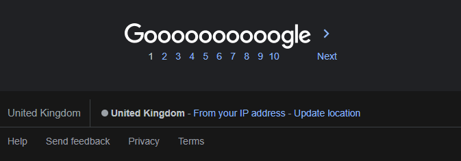

# Google Antidox

A simple chromium extension that removes footer that contains your location from google search.

## Installation

1. Download repository from github by clicking **Code** -> **Download ZIP**.

2. Unpack the archive. After installation you won't be able to move it.

3. Go to <chrome://extensions> and turn on **Developer mode**. After that developer options will appear. Click **Load unpacked** and choose the folder of the unpacked archive.

4. Done!
